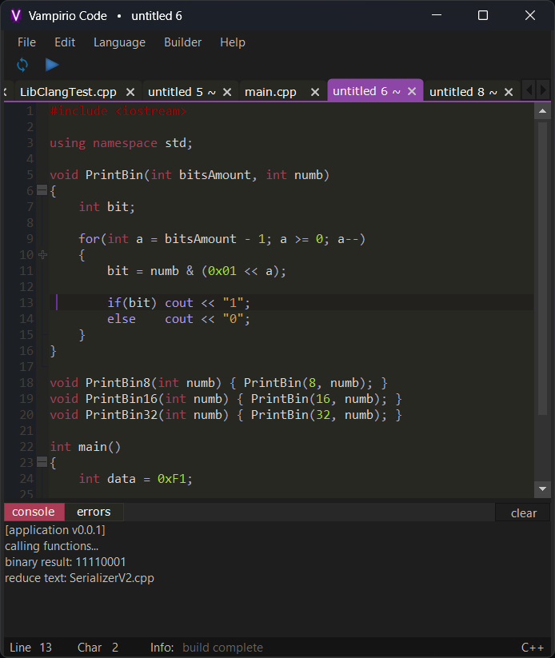
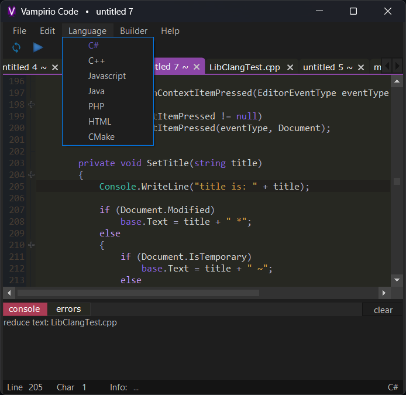
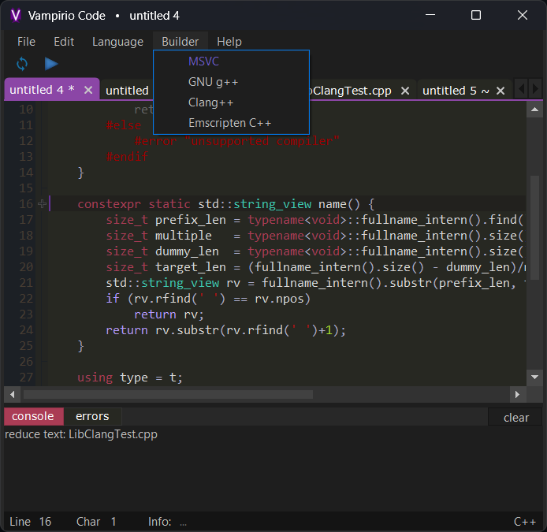
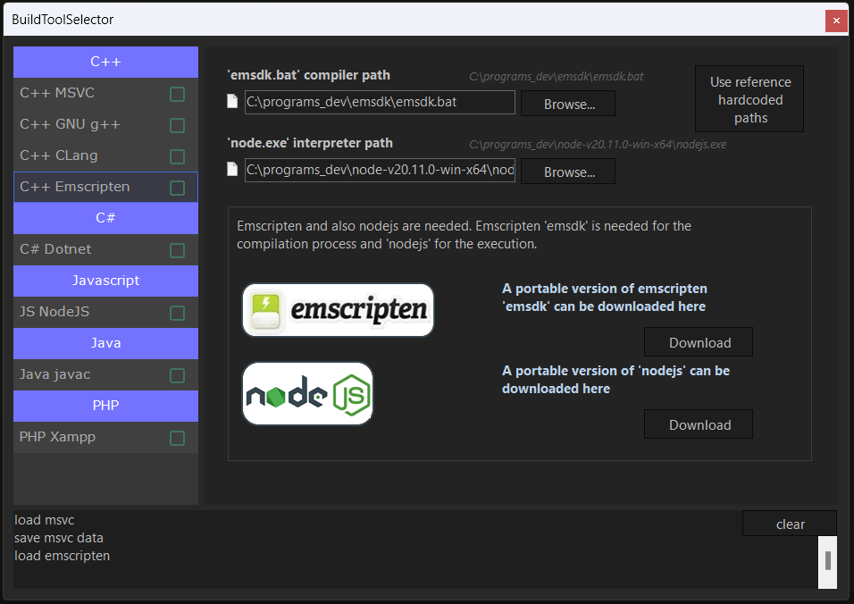
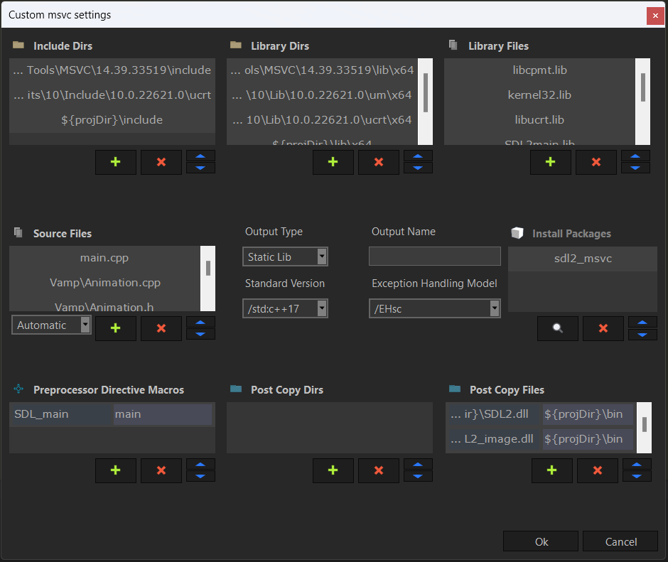

# Vampirio Code
A versatile code editor that supports syntax highlighting and compilation on many well known languages like C#, C++, Javascript, JAVA, HTML, PHP and CMake

Its functionalities are:

* One simple file can be compiled with F5 without saving it
* Syntax highlighting
* Already integrated to 'dotnet' and 'msvc' compilers
* Tab manager
* C#, C++, Javascript, JAVA, HTML, PHP and CMake supported
* MSVC, GNU g++, CLang and Emscripten compilers supported
* Javac and Java supported
* Node.js and Xampp supported 

 

   

   

   

   

